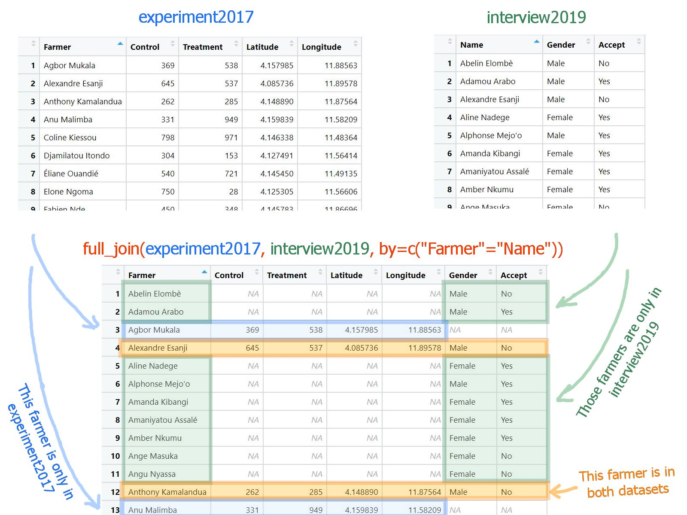
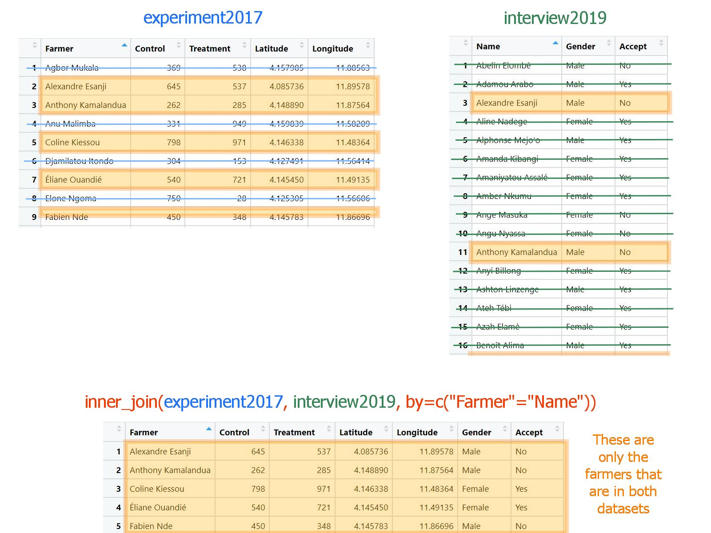
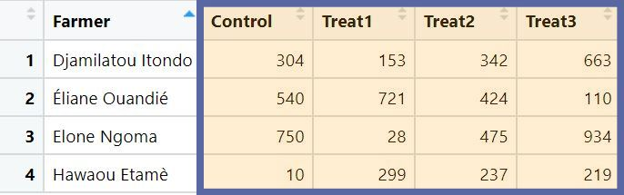
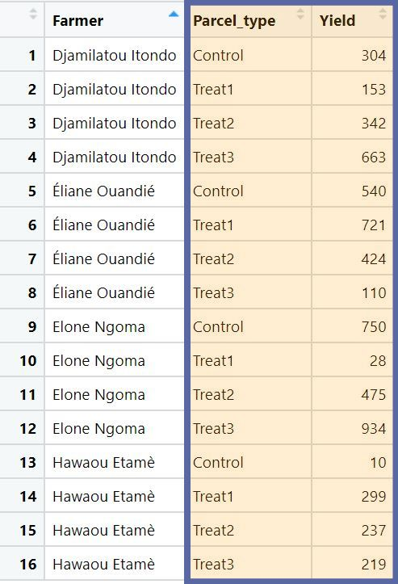

```{r setup,include=FALSE}
library(dplyr)
library(ggplot2)
library(tidyr)
library(learnr)

experiment2017<-read.csv("experiment2017.csv")
interview2019<-read.csv("interview2019.csv")


MergedData<-inner_join(experiment2017,interview2019,by=c("Farmer"="Name"))

LongData <- MergedData %>%
  pivot_longer(cols=Control:Treatment, names_to="Plot_type",values_to="Yield")


```

# Merging and Reshaping data


## Overview

This tutorial gives a short introduction to some very useful data manipulation processes:

Merging data using he `_join()` functions from within the `dplyr` library

Reshaping data using the `pivot_()` functions from the `tidyr` library

These functions can be incredibly useful for bringing together data from multiple sources into a consistent tidy format ready for analysis. Trying to replicate this sort of functionality in Excel is extremely time-consuming and has high potential for human error.

This tutorial provides just a few examples, to show how the code works, but links are provided to more extensive resources if this is something you are interested in learning more about.

If you're trying to replicate what's in this workbook on your computer, note that you may not already have the `tidyr` library installed, so make sure you have it downloaded and then loaded before following the code in RStudio. You should already have `dplyr` installed within RStudio, but you will still need to remember to load it.

```
library(dplyr)
library(tidyr)
```

## Data for this session

In this session we will use two related fictive datasets. The first one, called `experiment2017` is an on farm experiment, where each of 20 farmers has collected values of yield for two plots, one where a new treatment has been applied (column "Treatment"), and one where this new treatment has not been applied (column "Control").  

The other dataset called `interview2019` contains the responses of 71 farmers - some of which participated in the 2017 experiment - when asked whether they would accept to participate to a new experiment (column "Accept"). You can download these two datasets [here](https://github.com/stats4sd/R4CCRP_08Merge/raw/main/data-merge.zip) 

Our goal will be to combine these two datasets in order to explore whether for a farmer, the outcome of the 2017 experiment is related to their willingness to participate in a new experiment.


You can have a look at the `experiment2017` dataset here:


```{r,echo=FALSE}
DT::datatable(experiment2017)
```

And you can explore the `interview2019` dataset below:


```{r,echo=FALSE}
DT::datatable(interview2019)
```

## Full joins

dplyr has a number of clever functions for merging data. In all cases we need to have two data frames which share a common ID variable or variables. In this session we will cover two of the key ones `full_join()` and `inner_join()`


`full_join()` will give us an output data frame which contains all of the rows from both datasets we are trying to merge, whether or not there is a match in the corresponding data or not. If there is no match, missing values will be filled in for the columns from the corresponding data frame.

Here is a diagram that tries to explain it using the `experiment2017` and `interview2019` datasets:


```{r echo=FALSE, out.width="85%", fig.align='center'}

```

<br>


In `full_join()`, we need to provide the names of two data frames, and then the argument "by" to provide the common ID variable or variables. In this case we have one common ID variable which is the names of the farmers. It is found in the column `Farmer` for the `experiment2017` dataset and in the column `Name` for the `interview2019` dataset. So using the following command, we will get an output containing all the farmers and columns from both datasets:


```{r fj,exercise=TRUE}
full_join(experiment2017,interview2019,by=c("Farmer"="Name"))
```

As you see, in the *by* statement, we indicated the column name `Farmer` of the first indicated dataset (`experiment2017`) on the left of the equal sign, and the column name `Name` of the second dataset (`interview2019`) on its right. The order matters.


Also note that none of the farmers have the same name, but in general this can easily happen, which would mess up our join as R would be unable to know how to combine the multiple rows with same names. That's why you should always use an ID variable - or combination of variables - that you **know** will be unique to each farmer. A good way to ensure that is to generate and assign a unique ID to each farmer yourself.


Anyway, back to the result of `full_join()`. We started with two dataframes, one with 20 farmers, the other one with 71 farmers, and the resulting dataframe contains 80, which is the total number of distinct farmers. If you carefully check the output, you will see that there is quite a number of missing values in it (`NA`). This is because we kept the data of every farmer. Some farmers are in both datasets, but all the other farmers are only in one of the two datasets. When it is the case, the rest of the data is filled with NAs. 


This is not what we want though. What we want is to only keep the combined data for those farmers that are in both datasets. We can achieve that using an inner join.

## Inner joins

`inner_join()` will give us an output data frame which only contains the rows that match.

```{r echo=FALSE, out.width="85%", fig.align='center'}

```

<br>

So with our example it will only include the farmers that participated in the 2017 experiment and then where asked whether they'd be willing to participate in a new experiment. We won't have any missing values created with an `inner_join`. 


```{r ij, exercise=TRUE}
inner_join(experiment2017,interview2019,by=c("Farmer"="Name"))

```

As you see, we started again with 20 rows for one dataset and 71 rows for the other one, and after using `inner_join`, we are left with only 11 rows. These are the farmers for which we can do our analysis. So let's save this merged dataset as an object called `MergedData`, to use in the next steps.

```{r assign, exercise=TRUE}
MergedData<-inner_join(experiment2017,interview2019,by=c("Farmer"="Name"))

```

Remember that it's normal that we don't see any output, because we are saving the result as an object and not asking R to show us anything.

## More complex joining

These two join functions provide functionality which will cover most of the commonly needs you would have for merging two data sets together.
But there are several other ways of merging data together in dplyr with different `_join()` functions, which are worth being aware of for other situations.

There is a comprehensive tutorial on all the different joining functions in `dplyr` here:
https://rpubs.com/williamsurles/293454


## Going long

Despite having two measures of yield per farmer, the experiment2017 dataset has only one row per farmer. This is because it is in what is known as "wide" format. To better picture what we mean by  "wide" format, let's imagine a few farmers that would have collected 4 measures of yield. One for each of three treatments, and one for the control plot. The data for these farmers would look like the following:


```{r echo=FALSE, out.width="50%", fig.align='center'}

```


But this is not the format which R generally likes to operate on - R much prefers "long" format where we have one row per observation. In our little example, we had 4 observations per farmer, so in "long" format, we would have four rows for each farmer and instead of 4 numeric yield variables, we would only have two columns. A numeric one containing the values of yield, and a categorical one indicating the treatment or type of plots on which the yield was measured:

```{r echo=FALSE, out.width="35%", fig.align='center'}

```

And if you think to when we've used `ggplot2`, we always had one unique variable for our y argument, and we used categorical variables to separate it into groups, facets, colours and it was similar for modelling. We had one dependant variable only and the groups of the Anova were defined by come categorical variable. So in general long formats work much better than wide formats for making graphs or doing some statistical modelling.


And to help us analyse our dataframe `MergedData` where the experimental data is in wide format, we should turn it into long format.

The `pivot_longer()` function from the `tidyr` library allows us to do this. 

```{r gather0,exercise=TRUE}
MergedData %>%
  pivot_longer(cols=Control:Treatment, names_to="Plot_type",values_to="Yield")

```

If we pipe into the function, we need to supply three arguments:

* Which columns within the data are we 'pivotting' into the long format. We don't want all of the columns - only the ones which refer to the common attribute, that is the yield measures. We could use the function c() to indicate the columns to combine: `c(Control, Treatment)`, but our two columns are next to each other, so we can use a slight shortcut by using a colon: `FirstColumn:LastColumn`. In our case we have only two columns, so it's not much of a shortcut though. Note that we do not need to use quotation marks when referencing existing columns. This argument is called "cols".   

* The name of the new column where the existing column names will be placed in the restructured data. This argument is called "names_to" - it requires an input within quotation marks. In this case the columns are the two different types of plots (treatment or control), so we can call it "Plot_type" for example.  

* The name of the new column where the data values will be placed in the restructured data. This argument is called "values_to" - it requires an input within quotation marks. In this case the values refer to the yield in the plot, so it makes good sense to call it "Yield".  

If I wasn't using a pipe, the first argument of this function would need to be the dataframe.


Note that this new data has 22 rows - 1 row for each type of plot of each farmer.

In RStudio, you could see this in the environment pane; or by using the `dim()` function to get the dimensions. I am going to assign the previous step into a new object, called `LongData` and then check the dimensions this way to compare between the two data frames.


```{r gather1, exercise=TRUE}
LongData<- MergedData %>%
  pivot_longer(cols=Control:Treatment, names_to="Plot_type",values_to="Yield")

dim(LongData)
dim(MergedData)
```

Again, having the data in long format makes it much easier to analyse, plot or manipulate.


### Answering our original question

Remember that our objective was to explore the relationship between the outcome of the 2017 experiment and the willingness to participate in a new one. There are various plots that we could make for that. A nice one is to show the yield on the y axis, the plot type on the x axis, make lines connecting the yield of a same farmer so that each line represent one farmer, and add colour to the lines based on whether the farmer accepted or not to participate in a new experiment:

```{r gather2, exercise=TRUE}
LongData %>%
  ggplot(aes(x=Plot_type, y=Yield, color=Accept, group=Farmer))+
  geom_line()
```
Notice that it is the group aesthetics that define which are the points connected by the lines. In our case, these are the points corresponding to a same farmer.

We can see that most of the lines that go down are red, that is most of the farmers who saw a decrease in yield between the control and treatment plots during the 2017 experiment, did not want to participate in a new experiment according to the 2019 interview. In contrast, the lines that go up are blue. This might be easier to see using facets:

```{r gather3, exercise=TRUE}
LongData %>%
  ggplot(aes(x=Plot_type, y=Yield, color=Accept, group=Farmer))+
  geom_line()+
  facet_wrap(~Accept)
```

## Going wide


If we had our data in long format and wanted to go to wide format, we could use the function `pivot_wider()`, which is in effect the reverse of the `pivot_longer()` function. So it requires the reverse inputs:

```{r gather4, exercise=TRUE}
LongData %>%
      pivot_wider(names_from=Plot_type,values_from=Yield)
```

* The names column from which each unique value in this column will become one of the column names in the new data. This argument is "names_from".  
* The value column from the data - which will make up the contents of these new columns. This argument is "values_from".  

So in this case the "names_from" column is `Plot_type`and the "values_from" is `Yield`.

We got our data back in wide format!


## More complex transformations

Like the `_join()` set of functions, the `pivot_()` set of functions have lots of extensions, which can allow for lots of flexibility in reshaping your data.
If you are interested in learning more about this, a tutorial can be found here: https://tidyr.tidyverse.org/articles/pivot.html